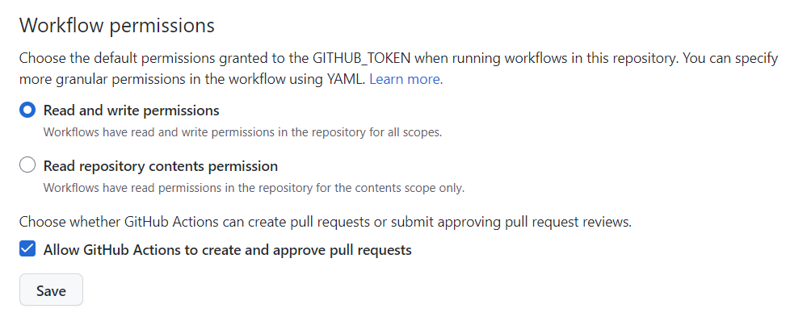
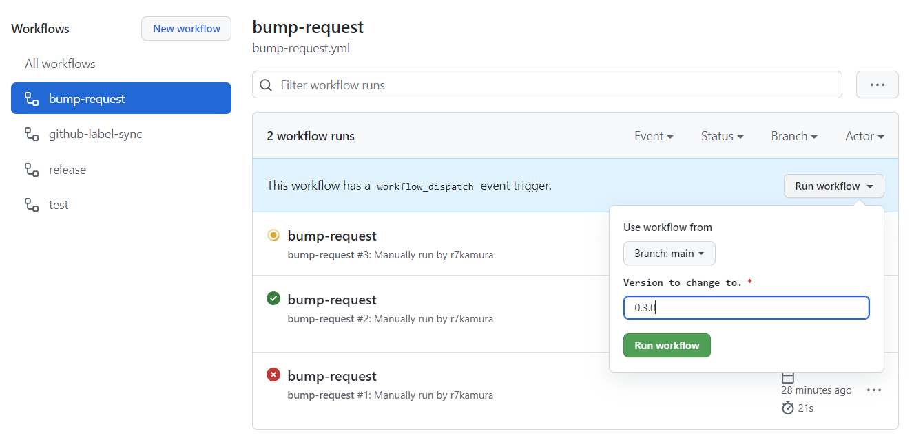
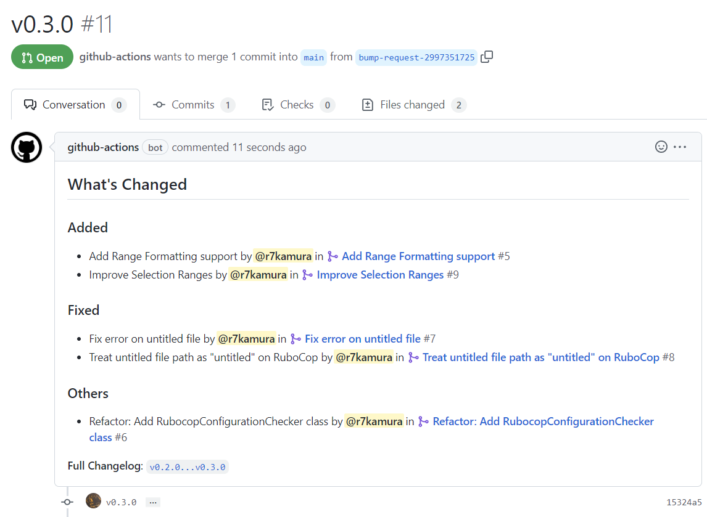

# bump-request

[Custom action](https://docs.github.com/en//actions/creating-actions/about-custom-actions) to create a pull request that bumps version.

## Usage

Create a workflow file as follows:

```yaml
# .github/workflows/bump-request.yml
name: bump-request

on:
  workflow_dispatch:
    inputs:
      release_type:
        type: choice
        description: How to bump the version.
        options:
          - major
          - minor
          - patch
        default: patch

jobs:
  run:
    runs-on: ubuntu-latest
    steps:
      - uses: r7kamura/bump-request@v0
        with:
          command: |
            npm version --no-git-commit-hooks --no-git-tag-version "$VERSION"
          release_type: ${{ inputs.release_type }}
```

Then allow your repository to create pull requests from GitHub Actions:



Now you can run it manually via actions page:



or if you want to do it from CLI, use [GitHub CLI](https://cli.github.com/) like this:

```bash
gh workflow run bump-request --field request_type=patch
```

After the action is complete, a new pull request is created:



This action uses [Automatically generated release notes](https://docs.github.com/en//repositories/releasing-projects-on-github/automatically-generated-release-notes) to generate a pull request description.
If you want to customize the contents, try setting up `.github/release.yml` according to this documentation.

This action simply creates a pull request and does nothing more. If you want to automate package publishing, Git tagging, etc., it is recommended to prepare a separate workflow that detects changes in the file containing the version and does so, using [softprops/action-gh-release](https://github.com/softprops/action-gh-release) or other actions.

## Inputs

### `command`

Shell command for modifying files that contain versions such as package.json, Catgo.toml, etc. Note that the next version is passed as an environment variable `VERSION`.

- required

NPM package example:

```yaml
command: |
  npm version --no-git-commit-hooks --no-git-tag-version "$VERSION"
```

Ruby gem example:

```yaml
command: |
  sed -i -r "s/[0-9]+\.[0-9]+\.[0-9]+/$VERSION/" lib/my_ruby_gem/version.rb
  bundle install
```

### `release_type`

How to bump the version.

One of:

- `major`
- `minor`
- `patch`

The next version is calculated based on the latest GitHub release,
so your repository must manage its versions with GitHub releases.

### `version`

You can also specify this directly instead of `release_type`.

- e.g. `1.2.3`
