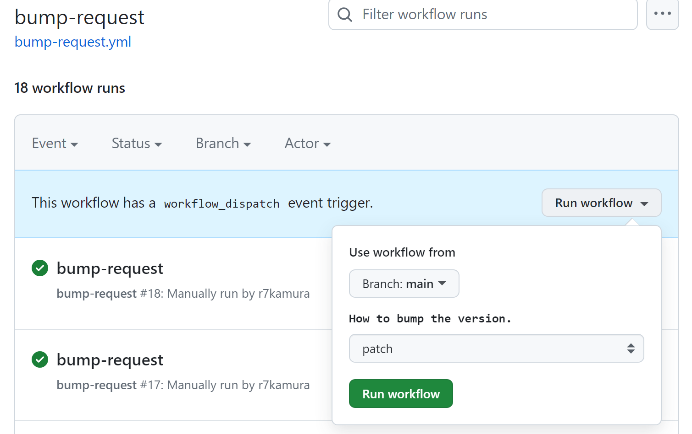

# bump-request

[Custom action](https://docs.github.com/en//actions/creating-actions/about-custom-actions) to create a pull request that bumps version.

## Usage

Create a workflow file as follows:

```yaml
# .github/workflows/bump-request.yml
name: bump-request

on:
  workflow_dispatch:
    inputs:
      version:
        description: Version to change to.
        required: true
        type: string

jobs:
  run:
    runs-on: ubuntu-latest
    steps:
      - uses: r7kamura/bump-request@v0
        with:
          command: |
            npm version --no-git-commit-hooks --no-git-tag-version "${{ inputs.version }}"
          version: ${{ inputs.version }}
```

Now you can run it manually via actions page:



or if you want to do it from CLI, use [GitHub CLI](https://cli.github.com/) like this:

```bash
gh workflow run bump-request --field version=1.2.3
```

After the action is complete, a new pull request is created.

## Inputs

### `command`

Shell command for modifying files that contain versions such as package.json, Catgo.toml, etc.

- required

NPM package example:

```yaml
command: |
  npm version --no-git-commit-hooks --no-git-tag-version "${{ inputs.version }}"
```

Ruby gem example:

```yaml
command: |
  sed -i -r 's/([0-9]+\.[0-9]+\.[0-9]+)/${{ inputs.version }}/' lib/my_ruby_gem/version.rb
  bundle install
```

### `version`

Version to change to.

- required
- e.g. `1.2.3`

### `gh_pr_create_options`

Additional options for `gh pr create` command.

- optional
- e.g. `--draft`
